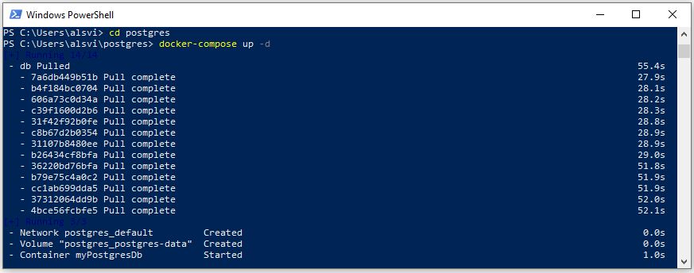

# Docker Compose
## Descrição do projeto
Arquivo docker-compose para automatização da instalação do Postgresql no docker

## Funcionalidades do projeto
- `Funcionalidade 1`: atomatiza o processo de instalação do gerenciador do PostgreSQL no docker.
- `Funcionalidade 2`: cria um volume para persistência dos dados.

## Aplicação


## Execução
Iniciando o docker-compose o parametro -d, para rodar em segundo plano
```bash
docker-compose up -d
```

Caso precise parar todos os containers do aquivo
```bash
docker-compose down
```

Para remoção do arquivo
```bash
docker-compose rm
```

## Autor

| [<br><sub>Alan Vieira</sub>](https://github.com/alan-vieira) |
| :---: |
